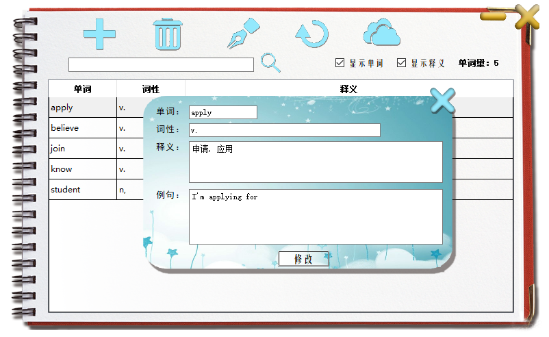

# vocabulary
基于Qt设计一款单词本软件，使用SQLite存储数据，提供美观的操作界面。

## 程序逻辑

- 程序运行后，显示单词本界面作为主窗口，同时从SQLite数据库中读取数据显示成列表。
- 用户可以点击几个按钮打开几个子窗口。进行增删查改等操作。后来还加入了登录界面、同步功能（但是没连接到服务器）。
- 用户可以使用按钮或快捷键进行增删查改等操作。
- 后来还加入了登录界面，以便同步单词本数据（但是没连接到服务器）。

## 运行结果

## review

几年前写的代码，现在看来代码质量较差，比如重复编写一些语句、标识符取名不易懂。

不过，该项目的ps修图已经达到我的审美极限了。

这是我第一次独立设计一款软件，留个纪念。